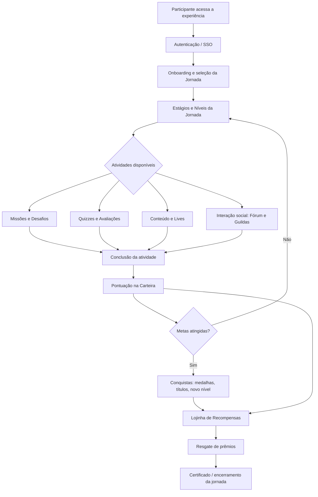
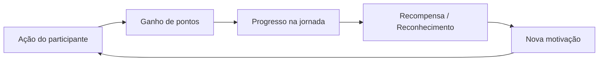

# 02 — Jornada Gamificada e Mecânicas Centrais

**Plataforma:** EVNTTZ. · **Versão:** 1.0 · **Data:** 2026-06-09

---

## 1. Objetivo da Gamificação

A gamificação da EVNTTZ. tem como propósito **aumentar o engajamento e a
retenção do participante** ao longo de toda a experiência do evento,
transformando ações (assistir conteúdo, responder quizzes, participar de
atividades, interagir socialmente) em progresso mensurável e recompensas
tangíveis. A experiência pode ser usada de forma **autônoma** ou **embarcada**
em aplicativos parceiros.

## 2. Fluxo Principal da Jornada

## 3. Mecânicas Centrais

### 3.1 Jornadas (Journeys)
Trilhas estruturadas em **níveis** e **estágios**. O participante avança ao
concluir atividades, desbloqueando novos conteúdos e desafios de forma
progressiva.

### 3.2 Missões e Desafios (Missions / Challenges)
Tarefas objetivas com critérios de conclusão. Podem exigir resposta a
formulários, presença em atividades ou execução de ações específicas, gerando
pontuação ao serem cumpridas.

### 3.3 Quizzes e Avaliações
Questionários com perguntas e alternativas, com registro de tentativas e
respostas. Reforçam o aprendizado e atribuem pontos conforme o desempenho.

### 3.4 Carteira, Pontos e Moedas (Wallet)
Cada participante possui uma **carteira** que acumula pontos/moedas virtuais a
partir das ações realizadas. A carteira registra **movimentações** e é a base
para subir de nível e resgatar recompensas.

### 3.5 Progressão: Níveis, Medalhas e Títulos
A pontuação acumulada eleva o participante de **nível** e desbloqueia
**medalhas** e **títulos**, oferecendo reconhecimento e senso de evolução.

### 3.6 Lojinha de Recompensas (Store / Prizes)
Espaço onde o participante **troca pontos/moedas por prêmios** e recompensas.
Inclui regras de elegibilidade e fluxo de solicitação/resgate.

### 3.7 Camada Social: Fórum e Guildas
- **Fórum** — espaço de discussão e comunidade.
- **Guildas (Guilds)** — grupos colaborativos com jornadas, missões e
  recompensas compartilhadas, estimulando a competição e a cooperação.

### 3.8 Recursos de Apoio
Programação, lives/transmissões, biblioteca de conteúdo, FAQ, convites e
páginas customizadas complementam a experiência.

## 4. Ciclo de Engajamento (Loop)

O **loop central** — ação → pontuação → progresso → recompensa → nova ação — é o
mecanismo que sustenta o engajamento contínuo ao longo do evento.

## 5. Resultados Esperados

- Maior **tempo de permanência** e participação ativa nas atividades.
- Maior **conclusão de conteúdos** e trilhas de aprendizagem.
- Estímulo à **interação social** e à formação de comunidade.
- Dados de engajamento que alimentam **relatórios e dashboards** para o produtor.
