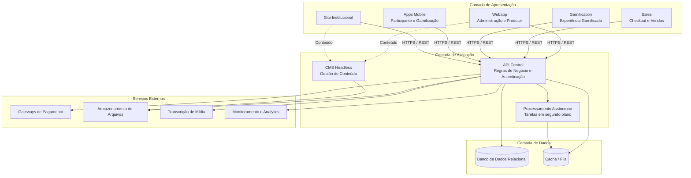

# 03 — Diagrama de Arquitetura de Alto Nível

**Plataforma:** EVNTTZ. · **Versão:** 1.0 · **Data:** 2026-06-09

> Este documento apresenta a arquitetura em **nível conceitual**. Não expõe
> segredos de implementação, endpoints internos, credenciais ou configurações
> sensíveis.

---

## 1. Visão Geral

A EVNTTZ. adota uma arquitetura de **aplicações desacopladas** orientada a
capacidades de negócio. Uma **API central** concentra as regras de negócio e os
dados, enquanto múltiplas **aplicações de front-end** atendem a diferentes
personas e casos de uso. As aplicações são **independentemente implantáveis** e
não compartilham estado em tempo de execução.

## 2. Diagrama de Arquitetura

## 3. Camadas e Responsabilidades

### 3.1 Camada de Apresentação (Front-ends)
| Aplicação | Responsabilidade |
|-----------|------------------|
| **Webapp** | Painel administrativo e do produtor (multi-tenant). |
| **Sales** | Checkout isolado e páginas de venda otimizadas para conversão. |
| **Gamification** | Experiência gamificada do participante (standalone e embarcável). |
| **Apps Mobile** | Aplicativos do participante e da experiência gamificada. |
| **Site** | Site institucional e marketing. |

### 3.2 Camada de Aplicação
| Componente | Responsabilidade |
|-----------|------------------|
| **API Central** | Concentra regras de negócio, autenticação/autorização e exposição de dados via REST. |
| **Processamento Assíncrono** | Executa tarefas pesadas e diferidas (envios, processamentos, integrações). |
| **CMS Headless** | Gerencia conteúdo editorial consumido pelas demais aplicações. |

### 3.3 Camada de Dados
- **Banco de dados relacional** — fonte de verdade dos dados de negócio, com
  **isolamento multi-tenant** por organização/evento.
- **Cache / fila** — acelera leituras e suporta o processamento assíncrono.

### 3.4 Serviços Externos
Pagamento, armazenamento de arquivos, transcrição de mídia e monitoramento são
consumidos pela API por meio de integrações **conceituais** — sem exposição de
credenciais ou endpoints nesta documentação.

## 4. Princípios Arquiteturais

1. **Desacoplamento** — comunicação exclusiva via API REST sobre HTTPS.
2. **Multi-tenancy** — isolamento de dados por organização/evento em toda consulta.
3. **Implantação independente** — cada aplicação evolui e escala separadamente.
4. **Segurança por padrão** — autenticação OAuth2 e autorização por perfil.
5. **Escalabilidade horizontal** — front-ends e workers escaláveis sob demanda.
6. **Observabilidade** — monitoramento de erros e métricas em produção.

## 5. Padrões de Comunicação

- **Front-ends ↔ API:** HTTPS / REST com autenticação por token (OAuth2).
- **API ↔ Serviços externos:** integrações seguras server-to-server.
- **Tarefas assíncronas:** desacopladas por fila, sem bloquear requisições do usuário.
