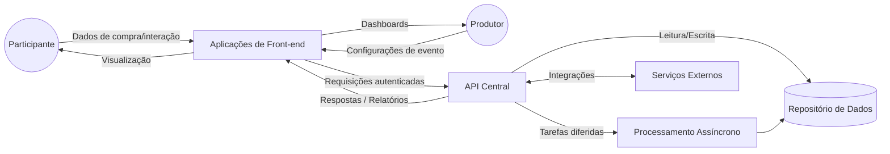
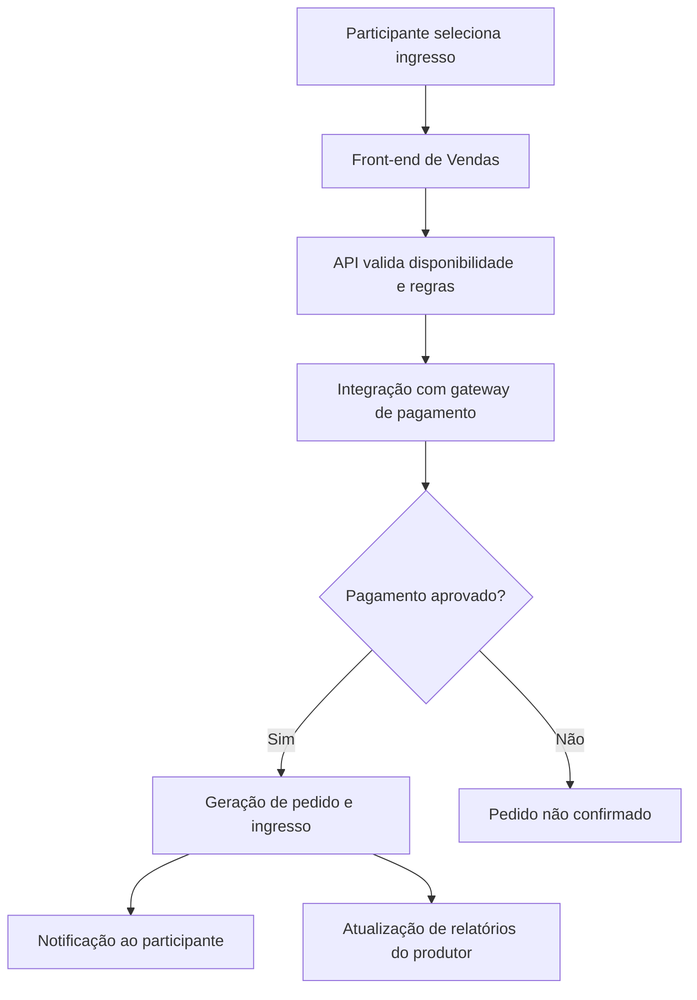
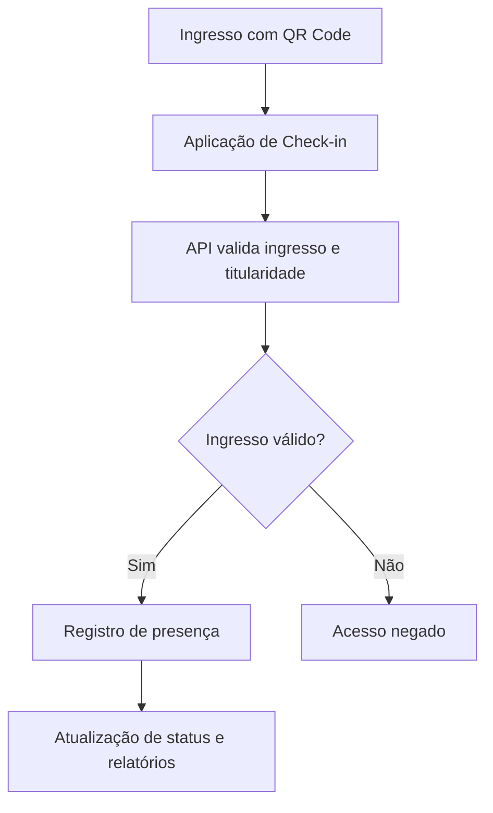
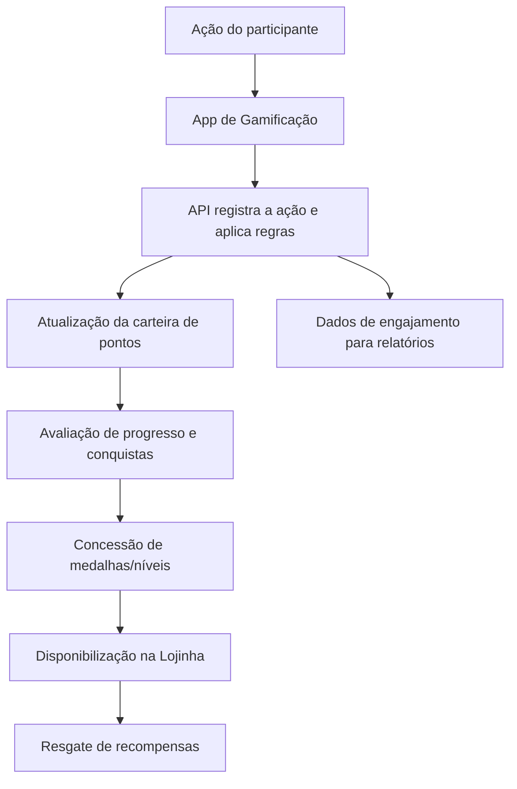

# 04 — Diagrama de Fluxo de Dados (Conceitual)

**Plataforma:** EVNTTZ. · **Versão:** 1.0 · **Data:** 2026-06-09

> Fluxo de dados em **nível conceitual**. Não expõe credenciais, endpoints
> internos, esquemas de banco ou configurações sensíveis.

---

## 1. Objetivo

Descrever, de forma conceitual, como os dados trafegam entre os atores e os
componentes da plataforma nos principais fluxos de negócio: **venda**,
**check-in** e **gamificação**.

## 2. Fluxo de Dados — Visão Geral

## 3. Fluxo de Venda (Conceitual)

**Dados envolvidos (categorias):** dados cadastrais do comprador, dados do
pedido/ingresso e confirmação de pagamento. **Dados sensíveis de pagamento são
tratados pelo gateway externo**, não trafegando de forma exposta na plataforma.

## 4. Fluxo de Check-in (Conceitual)

## 5. Fluxo de Gamificação (Conceitual)

## 6. Categorias de Dados Tratados

| Categoria | Exemplos (conceituais) | Observação |
|-----------|------------------------|------------|
| **Identidade** | Nome, e-mail, perfil de acesso | Protegido por autenticação e LGPD |
| **Eventos** | Configurações, datas, locais, programação | Isolado por tenant |
| **Comercial** | Pedidos, ingressos, cupons | Confirmação de pagamento via gateway externo |
| **Gamificação** | Pontos, conquistas, progresso, interações | Base do engajamento |
| **Conteúdo** | Páginas, mídias, materiais | Gerenciado no CMS |
| **Operacional** | Logs de erro e métricas | Para monitoramento |

## 7. Princípios de Tratamento de Dados

1. **Isolamento multi-tenant** — dados segregados por organização/evento.
2. **Trânsito seguro** — comunicação cifrada (HTTPS) entre todas as camadas.
3. **Minimização de exposição** — dados sensíveis de pagamento delegados a parceiros especializados.
4. **Aderência à LGPD** — coleta, uso e retenção de dados pessoais conforme finalidade.
5. **Rastreabilidade** — movimentações relevantes (ex.: carteira) são registradas.
