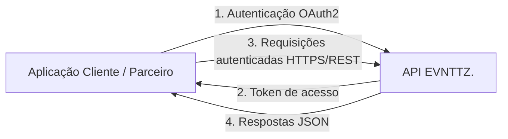
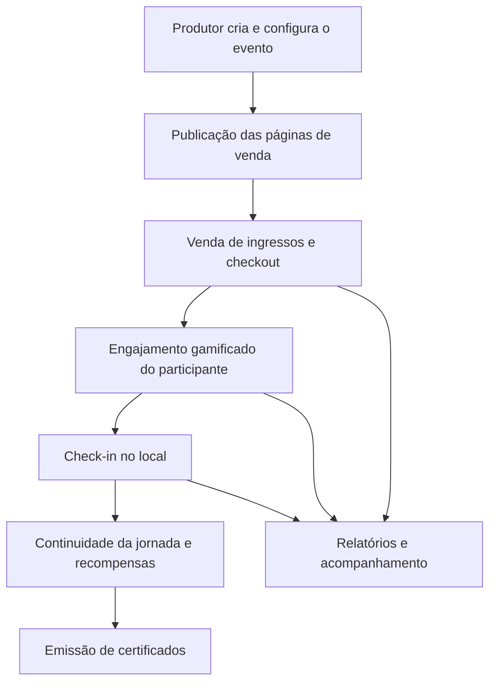

# 06 — Manual Resumido de Integração e Operação

**Plataforma:** EVNTTZ. · **Versão:** 1.0 · **Data:** 2026-06-09

> Manual de alto nível. **Não** contém payloads sigilosos, chaves de acesso,
> endpoints internos ou segredos de configuração.

---

## 1. Modelo de Integração

A integração com a plataforma EVNTTZ. ocorre por meio de uma **API REST sobre
HTTPS**, com autenticação **OAuth2**. Aplicações cliente e parceiros consomem os
recursos da API mediante **token de acesso** emitido após autenticação.

### Princípios de Integração
1. **Autenticação obrigatória** — toda operação exige token válido.
2. **Autorização por perfil** — o acesso a recursos respeita a persona/escopo.
3. **Isolamento multi-tenant** — cada requisição opera no contexto da sua organização/evento.
4. **Comunicação cifrada** — exclusivamente via HTTPS.

## 2. Integração de Gamificação Embarcada (Parceiros)

A experiência gamificada pode ser **embarcada** em aplicativos parceiros via
**WebView/iframe**, com fluxo de autenticação dedicado para o contexto do
parceiro. Isso permite oferecer jornadas, missões e recompensas dentro de um app
de terceiros sem expor a infraestrutura interna.

## 3. Operação das Aplicações

| Aplicação | Papel na Operação |
|-----------|-------------------|
| **API** | Núcleo operacional: regras de negócio, autenticação e dados. |
| **Webapp** | Operação pelo produtor/administrador: configuração de eventos, vendas e relatórios. |
| **Sales** | Operação de vendas e checkout. |
| **Gamification** | Operação da experiência do participante. |
| **Check-in** | Operação de acesso no local do evento. |
| **CMS** | Operação de conteúdo editorial. |

### Processamento Assíncrono
Tarefas demoradas (processamentos, envios e integrações) são executadas em
**segundo plano**, fora do caminho da requisição do usuário, garantindo respostas
rápidas e maior estabilidade.

## 4. Ambientes

| Ambiente | Uso |
|----------|-----|
| **Desenvolvimento** | Construção e testes locais pela equipe. |
| **Preview/Homologação** | Validação de mudanças antes da produção. |
| **Produção** | Ambiente final de uso pelos clientes. |

Configurações são gerenciadas por **variáveis de ambiente validadas**, com
separação entre valores compartilhados e específicos de cada aplicação. **Os
valores em si não são divulgados** nesta documentação.

## 5. Ciclo Operacional de um Evento (Resumo)

## 6. Boas Práticas Operacionais

- **Versionamento** de configurações e mudanças (ver
  [08 — Registro de Versões](./08-registro-de-versoes.md)).
- **Monitoramento contínuo** de erros e métricas (ver
  [05 — Capacidade e Operação](./05-capacidade-integracoes-operacao.md)).
- **Backup periódico** e plano de recuperação.
- **Validação automatizada** antes de publicar mudanças (ver
  [07 — Relatório de Testes](./07-relatorio-de-testes.md)).

## 7. Suporte e Disponibilização de Detalhes

Especificações técnicas detalhadas de integração (contratos de API completos,
exemplos de payload, credenciais e endpoints) são fornecidas em **ambiente
controlado**, mediante solicitação formal e acordo de confidencialidade.
